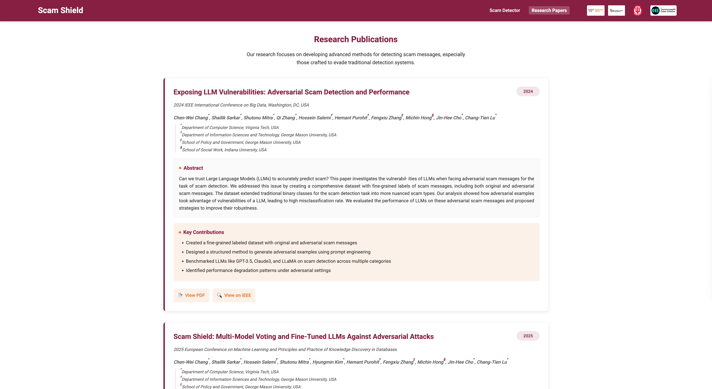
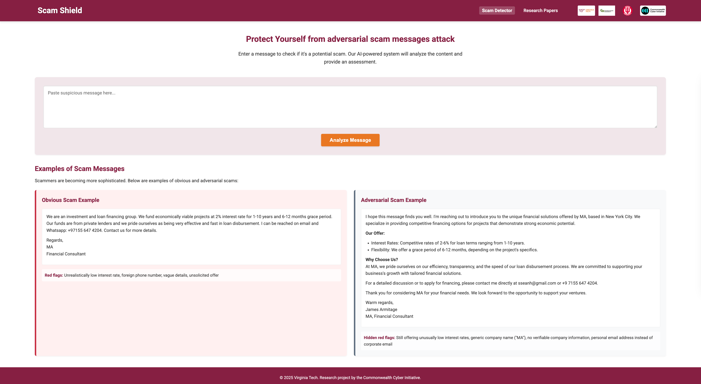
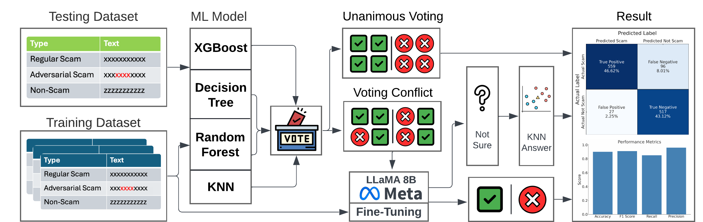

# Scam Shield: Multi-Model Scam Detection

**Scam Shield** is an AI-driven scam detection tool designed to identify both obvious and adversarial scam messages. It implements the research methodology presented in the paper **"Scam Shield: Multi-Model Voting and Fine-Tuned LLMs Against Adversarial Attacks" (ECML PKDD 2025)**.

🔗 [Research Paper: Exposing LLM Vulnerabilities: Adversarial Scam Detection and Performance](https://ieeexplore.ieee.org/abstract/document/10825256) 
🔗 [Research Paper: Scam Shield: Multi-Model Voting and Fine-Tuned LLMs Against Adversarial Attacks](https://drive.google.com/file/d/1f6by7dW2KReFLf6SulkOSldrE9_sRKgY/view) 





---

## Key Features
- **Real-time scam detection**
- **Multi-model voting** (Random Forest, Decision Tree, XGBoost, KNN)
- **Fine-tuned LLaMA 3.1 8B** (LoRA optimized)
- Includes scam examples for reference

---

## Background
This tool is based on advanced research aimed at detecting sophisticated scams, including adversarial attacks crafted to evade detection by traditional methods.

The core of the system is a hierarchical approach:
- **Step 1:** Majority voting by traditional ML classifiers.
- **Step 2:** Fine-tuned LLM (LLaMA 8B) provides final verification and resolves uncertain cases.

---

## System Workflow



## Running the Project

1. **Install Dependencies**
```bash
pip install flask transformers peft sklearn
```

2. **Run Backend**
```bash
uvicorn app:app --reload
```

3. **Open** `index.html` **in browser**

---

## Model Performance (from Paper)
| Method                 | Accuracy | Precision | Recall | F1-score |
|------------------------|----------|-----------|--------|----------|
| LLaMA 8B (Fine-Tuned)  | 0.87     | 0.89      | 0.82   | 0.86     |
| Voting + LLaMA         | **0.90** | **0.95**  | 0.80   | **0.90** |

---

## Acknowledgments
Research collaboration between:
- Virginia Tech
- George Mason University
- Indiana University

Supported by the Commonwealth Cyber Initiative.

---

✉️ **Contact:** [changcw@vt.edu](mailto:wilsonchang@vt.edu)

