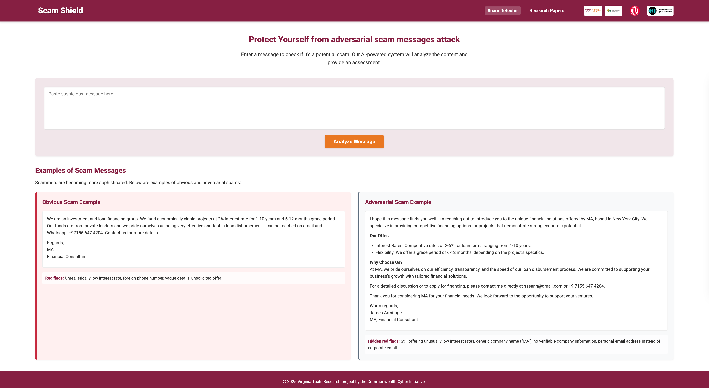
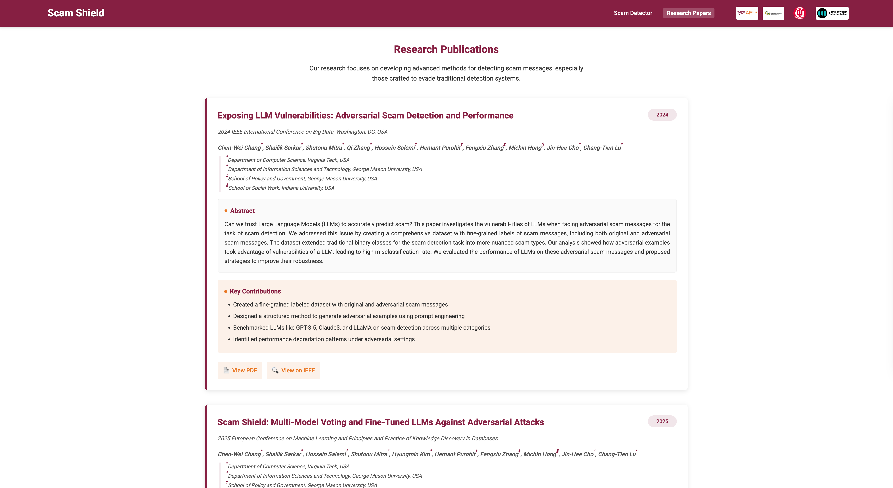
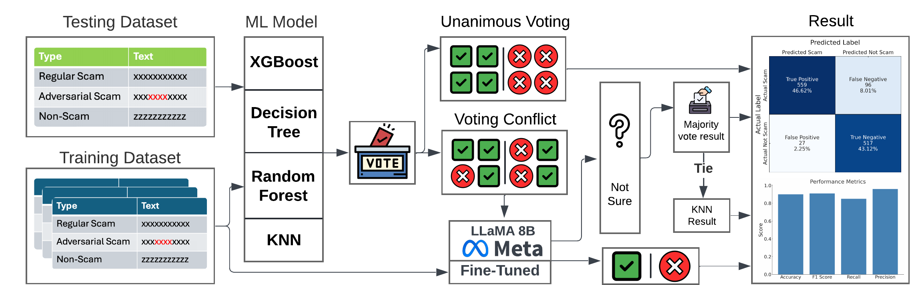

# Scam Shield: Multi-Model Scam Detection

**Scam Shield** is an AI-driven scam detection tool designed to identify both obvious and adversarial scam messages. This project is an implementation of the research presented in the following two papers: **"Exposing LLM Vulnerabilities: Adversarial Scam Detection and Performance" (IEEE BigData 2024)** and **"Scam Shield: Multi-Model Voting and Fine-Tuned LLMs Against Adversarial Attacks" (IEEE BigData 2025)**.

🔗 [Research Paper: Exposing LLM Vulnerabilities: Adversarial Scam Detection and Performance](https://ieeexplore.ieee.org/abstract/document/10825256) 

🔗 [Research Paper: Scam Shield: Multi-Model Voting and Fine-Tuned LLMs Against Adversarial Attacks](https://ieeexplore.ieee.org/document/11401779)





---

## Overview
Scam Shield is a FastAPI-based web application for scam message detection. The runtime system combines:

- **Four traditional ML models** for first-pass voting:
  Random Forest, Decision Tree, XGBoost, and KNN
- **A remote Hugging Face / Gradio-hosted LLM service** for:
  final tie-breaking when ML models disagree, and scam explanation generation
- **A lightweight browser UI** served directly by FastAPI static files

The local app loads pre-trained `.joblib` artifacts from `backend/models/` and calls a configured remote Hugging Face / Gradio service through `gradio_client`.

## Key Features
- **Real-time scam detection** from a web UI or API
- **Multi-model voting** across four ML classifiers
- **LLM-assisted final decision** when model votes disagree
- **LLM-generated explanation** for scam predictions
- **Built-in demo page** with scam / adversarial / benign examples

## Background
This repository implements a hierarchical scam detection workflow designed for adversarial scam messages that may evade single-model classifiers.

The decision flow is:

1. **TF-IDF vectorization** converts the input text into features.
2. **Four ML models** classify the message independently.
3. **If all models agree**:
   - unanimous `Not Scam`: return the result directly
   - unanimous `Scam`: return scam prediction and optionally fetch explanation from the LLM
4. **If models disagree**:
   the remote LLM makes the final decision

This design keeps the common path fast while reserving the more expensive LLM step for uncertain cases.

## System Workflow


## Project Structure
```text
scam-shield/
├── README.md
├── backend/
│   ├── app.py                  # FastAPI app and async polling endpoints
│   ├── ml_classifier.py        # ML voting logic and LLM fallback
│   ├── connectLLM.py           # Gradio client wrapper for HF Space
│   ├── requirements.txt        # Python dependencies
│   ├── models/                 # Pretrained TF-IDF + ML model artifacts
│   └── static/                 # Frontend HTML/CSS/images served by FastAPI
├── checkpoint-aug2/            # Fine-tuning checkpoint artifacts
└── pic/                        # README images
```

## Local Environment Setup

### Python Version
Use **Python `3.12.11`** for local development.

You can verify your interpreter with:

```bash
python3.12 --version
```

If your `python` command already points to `3.12.11`, that is also fine:

```bash
python --version
```

### Create and Activate a Virtual Environment
From the repository root:

```bash
# create a local virtual environment named .venv
python3.12 -m venv .venv

# activate it on macOS / Linux
source .venv/bin/activate
```

If your machine maps `python` to `3.12.11`, this also works:

```bash
python -m venv .venv
source .venv/bin/activate
```

### Upgrade pip
Recommended before dependency install:

```bash
python -m pip install --upgrade pip
```

## Install Dependencies
The dependency file used by the current codebase is:

`backend/requirements.txt`

Install dependencies after activating the virtual environment:

```bash
pip install -r backend/requirements.txt
```

### Current dependency set
The backend currently depends on:

- FastAPI / Uvicorn / Pydantic v1
- scikit-learn / XGBoost / joblib
- NumPy / pandas
- `gradio_client` and `httpx` for the Hugging Face connection
- `requests`, `python-dotenv`, and `openai`

Note: `python-dotenv` and `openai` are present in the dependency file, but the current runtime path in this repository does **not** require any environment variables to start locally.

## Run the Local Server

### Important: start from the `backend/` directory
The current code uses relative imports and relative model paths such as `models/...`, so you should launch the app from inside `backend/`.

```bash
cd backend
uvicorn app:app --reload
```

### Expected startup
By default, Uvicorn will start the server at:

- `http://127.0.0.1:8000`

Useful routes:

- `http://127.0.0.1:8000/`
  main scam detector page
- `http://127.0.0.1:8000/research`
  research page redirect
- `http://127.0.0.1:8000/docs`
  FastAPI Swagger UI

Once the server is running, the frontend is already included through `backend/static/`; no separate frontend dev server is needed.

## How the Runtime Works

### Request flow
When a user submits a message from the UI, the frontend sends:

```http
POST /classify
Content-Type: application/json
```

Request body:

```json
{
  "text": "Your message goes here"
}
```

### Backend behavior
`/classify` calls `classify_message_ml(..., defer=True)`, which means the API may respond in one of two ways:

1. **Completed immediately**
   - typically when ML models unanimously classify the message as `Not Scam`
2. **Pending**
   - when the system still needs the remote LLM to generate:
     - a scam explanation, or
     - a final decision for mixed ML votes

If the result is pending, the response includes a `task_id`, and the frontend polls:

```http
GET /classify/status/{task_id}
```

### Response shape
The API returns fields such as:

- `label`
- `reason`
- `votes`
- `vote_summary`
- `consensus_status`
- `decision_source`
- `processing_state`
- `pending_reason`
- `pending_decision`
- `raw_prediction`
- `task_id`

Example immediate response:

```json
{
  "label": "Not Scam",
  "message": "Hi there, are we still meeting at 3pm?",
  "reason": null,
  "votes": {
    "scam": 0,
    "not_scam": 4
  },
  "vote_summary": "Vote Scam: 0 | Vote Not Scam: 4",
  "consensus_status": "Unanimous Not Scam (4/4)",
  "decision_source": "ml_unanimous",
  "processing_state": "completed",
  "pending_reason": false,
  "pending_decision": false,
  "raw_prediction": 0,
  "task_id": null
}
```

Example pending response:

```json
{
  "label": "Pending",
  "message": "Suspicious message...",
  "reason": null,
  "votes": {
    "scam": 2,
    "not_scam": 2
  },
  "vote_summary": "Vote Scam: 2 | Vote Not Scam: 2",
  "consensus_status": "LLM decision pending (2 vs 2)",
  "decision_source": "llm",
  "processing_state": "pending_decision",
  "pending_reason": false,
  "pending_decision": true,
  "raw_prediction": null,
  "task_id": "generated-task-id"
}
```

## Example API Usage

### Submit a message
From the repository root, after the server is running:

```bash
curl -X POST http://127.0.0.1:8000/classify \
  -H "Content-Type: application/json" \
  -d '{"text":"Virginia Department of Transportation Toll Violation Notice: This is your final notice regarding the unpaid toll balance on your account."}'
```

### Check pending task status
Replace `<task_id>` with the returned task identifier:

```bash
curl http://127.0.0.1:8000/classify/status/<task_id>
```

## Hugging Face Connection Notes

### What is sent to Hugging Face
The local backend forwards messages to the remote Gradio service in two cases:

- **ML vote disagreement**
  the LLM makes the final classification
- **Confirmed scam result**
  the LLM generates an explanation for why the message looks malicious

### Remote service used by the code
The current implementation in `backend/connectLLM.py` is wired to a specific Hugging Face Space via `gradio_client`.

For a public-facing README, the exact Space identifier is intentionally omitted here.

### If local inference fails
If the local app cannot connect to the remote Hugging Face service:

- verify you have working internet access
- confirm the Hugging Face Space is up and responding
- check whether the remote Gradio app interface changed
- keep `gradio_client` updated enough to handle newer Gradio server versions

This repository already includes:

- `gradio_client>=1.0.0`
- `httpx>=0.27.0`

That version note matters because newer Gradio deployments may require the OpenAPI-based flow rather than the older `/info` route behavior.

## Troubleshooting

### `ModuleNotFoundError` or model path errors at startup
Cause:
running Uvicorn from the repository root instead of `backend/`

Fix:

```bash
cd backend
uvicorn app:app --reload
```

### `pip install -r requirements.txt` fails from repo root
Cause:
there is no top-level `requirements.txt` in this repository

Fix:

```bash
pip install -r backend/requirements.txt
```

### The UI loads, but classification stays pending or errors
Cause:
the local server is running, but the remote Hugging Face / Gradio service is unavailable or slow

Check:

- terminal logs from Uvicorn
- connectivity to the Hugging Face Space
- whether the request is waiting on `/classify/status/{task_id}`

### Static page is missing
Cause:
`backend/static/` was not present or the app was started from the wrong location

The current app mounts static files directly from:

- `backend/static/`

### Docker does not match the local instructions
Current repo caveats:

- `backend/Dockerfile` uses **Python 3.9**, while the recommended local environment here is **Python 3.12.11**
- `backend/docker-compose.yml` references a `frontend/` directory that is not present in this repository

For now, the most reliable path is the local `venv` flow documented above.

## Model Performance (from Paper)
| Method                 | Accuracy | Precision | Recall | F1-score |
|------------------------|----------|-----------|--------|----------|
| LLaMA 8B (Fine-Tuned)  | 0.87     | 0.89      | 0.82   | 0.86     |
| Voting + LLaMA         | **0.90** | **0.95**  | 0.80   | **0.90** |

## Acknowledgments
Research collaboration between:

- Virginia Tech
- George Mason University
- Indiana University

Supported by the Commonwealth Cyber Initiative.
